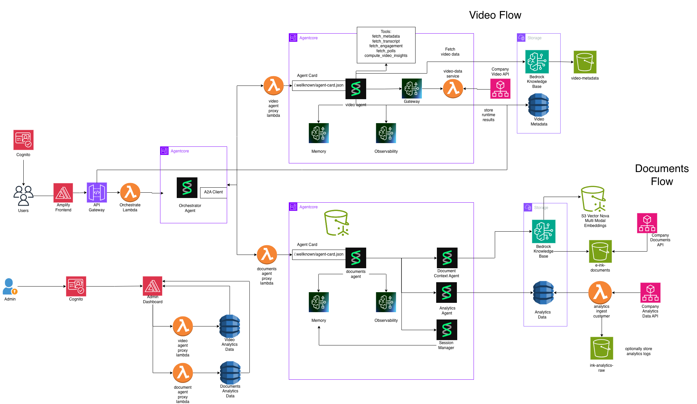

# Echo — A2A Multi-Agent Educational Platform on Amazon Bedrock AgentCore

A comprehensive implementation of the [Agent-to-Agent (A2A)](https://a2a-protocol.org/latest/) protocol using specialized agents running on [Amazon Bedrock AgentCore runtime](https://docs.aws.amazon.com/bedrock-agentcore/latest/devguide/runtime-a2a.html), powering an intelligent educational platform for course material creation, student preparation, video analytics, and document management.

This repository walks you through setting up a multi-agent orchestration system where specialized agents collaborate via A2A to handle distinct educational workflows — **Video Flow** and **Documents Flow** — all coordinated by a central orchestrator and backed by AgentCore primitives (memory, observability, identity, and gateway).

## Architecture



The system is composed of two primary flows:

### Video Flow
- A **Video Agent** (Strands SDK on AgentCore) exposes tools like `fetch_metadata`, `fetch_transcript`, `fetch_engagement`, `fetch_polls`, and `compute_video_insights`
- Requests route through an AgentCore **Gateway** to a **Fetch Video Data** Lambda that calls the Company Video API
- Results are stored in a **Bedrock Knowledge Base** backed by an S3 bucket (`video-metadata`) and a **Video Metadata** DynamoDB table
- The agent has its own **Memory** and **Observability** via AgentCore

### Documents Flow
- A **Documents Agent** (Strands SDK on AgentCore) delegates to sub-agents:
  - **Document Context Agent** — retrieves and manages educational documents via a Bedrock Knowledge Base with S3 Vector / Nova Multi-Modal Embeddings, reading from `e-ink-documents` S3 and the Company Documents API
  - **Analytics Agent** — tracks usage analytics, writing to Analytics Data (DynamoDB), with an analytics ingest Lambda pushing to the Company Analytics Data API and `ink-analytics-raw` S3
  - **Session Manager** — manages user sessions across interactions
- Each sub-component has its own **Memory** and **Observability**

### Orchestration & Auth
- Users authenticate via **Cognito** and interact through an **Amplify Frontend**
- Requests hit **API Gateway** → **Orchestrator Lambda** → **A2A Client** which routes to the appropriate agent runtime
- An **Admin Dashboard** (also behind Cognito) provides proxy Lambdas for video/document analytics data and agent management


> [!NOTE]
> **Default Models**
>
> This solution uses the following AI models by default:
> - **Host Agent (Strands)**: `global.anthropic.claude-sonnet-4-5-20250929-v1:0` (Amazon Bedrock)
> - **Echo Ink Agent (Strands)**: `global.anthropic.claude-sonnet-4-5-20250929-v1:0` (Amazon Bedrock)
> - **Echo Prepare Agent (Strands)**: `global.anthropic.claude-sonnet-4-5-20250929-v1:0` (Amazon Bedrock)
> - **Monitoring Agent (Strands)**: `global.anthropic.claude-haiku-4-5-20251001-v1:0` (Amazon Bedrock)
>
> These models can be customized during deployment.

## What is A2A?

<details>
  <summary>Agent-to-Agent (A2A)</summary>

   **Agent-to-Agent (A2A)** is an open standard protocol that enables seamless communication and collaboration between AI agents across different platforms and implementations. The A2A protocol defines:

   - **Agent Discovery**: Standardized agent cards that describe capabilities, skills, and communication endpoints
   - **Communication Format**: JSON-RPC 2.0-based message format for reliable agent-to-agent communication
   - **Authentication**: OAuth 2.0-based security model for secure inter-agent communication
   - **Interoperability**: Platform-agnostic design allowing agents from different frameworks to collaborate

   Learn more about the A2A protocol: [A2A Specification](https://a2a-protocol.org/)

   ### A2A Support on Amazon Bedrock AgentCore

   Amazon Bedrock AgentCore provides native support for the A2A protocol, enabling you to:

   - **Deploy A2A-compliant agents** as runtime services with automatic endpoint management
   - **Secure authentication** via AWS Cognito OAuth 2.0 integration
   - **Agent discovery** through standardized agent card endpoints
   - **Scalable deployment** leveraging AWS infrastructure for production workloads
   - **Built-in observability** with CloudWatch integration and OpenTelemetry support

</details>

## Agents

| Agent | Role | SDK | Runtime |
|-------|------|-----|---------|
| **Host / Orchestrator** | Routes user requests to the correct downstream agent via A2A | Strands | AgentCore |
| **Echo Ink** | Creates educational documents (syllabi, exams, lesson plans) with sub-agent orchestration | Strands | AgentCore |
| **Echo Prepare** | Helps students study — web research, practice questions, confidence tracking | Strands | AgentCore |
| **Monitoring** | CloudWatch log/metric queries via MCP Gateway | Strands | AgentCore |
| **Video Agent** | Video metadata, transcripts, engagement analytics | Strands | AgentCore |
| **Documents Agent** | Document context retrieval, analytics, session management | Strands | AgentCore |

## Prerequisites

1. **AWS Account** with appropriate permissions — [Create AWS Account](https://aws.amazon.com/account/)
2. **AWS CLI** installed and configured — [Install](https://docs.aws.amazon.com/cli/latest/userguide/getting-started-install.html)
   ```bash
   aws configure set region us-west-2
   ```
3. **Python 3.8+**
4. **uv** package manager — [Install guide](https://docs.astral.sh/uv/getting-started/installation/)
5. **API Keys**:
   - **Tavily API Key**: [tavily.com](https://tavily.com/) (for Echo Prepare web search)

6. **Supported Regions**:

   | Region Code | Region Name | Status |
   |-------------|-------------|--------|
   | `us-west-2` | US West (Oregon) | ✅ Supported |

## Quick Start

```bash
# Clone the repository
git clone https://github.com/aaravmat1209/agent_orchestration_echo.git
cd agent_orchestration_echo

# Run the interactive deployment script (works on CloudShell)
bash deploy.sh
```

The deployment script handles: AWS CLI verification, credential checks, parameter collection, S3 bucket creation, and parallel CloudFormation stack deployment (~10-15 min).

## Frontend

```bash
cd frontend
npm install
chmod +x ./setup-env.sh
./setup-env.sh
npm run dev
```

## Testing

```bash
# Test individual agents
uv run test/connect_agent.py --agent monitor
uv run test/connect_agent.py --agent host
```

### Bearer Tokens

```bash
uv run monitoring_strands_agent/scripts/get_m2m_token.py
uv run echo_ink_agent/scripts/get_m2m_token.py
uv run echo_prepare_agent/scripts/get_m2m_token.py
uv run video_strands_agent/scripts/get_m2m_token.py
uv run documents_strands_agent/scripts/get_m2m_token.py
uv run host_strands_agent/scripts/get_m2m_token.py
```

## A2A Protocol Inspector

Use the [A2A Inspector](https://github.com/a2aproject/a2a-inspector) to debug and validate A2A communication. Paste the agent URL and bearer token (`Bearer <token>`) along with headers `Authorization`, `X-Amzn-Bedrock-AgentCore-Runtime-Session-Id` (≥32 chars), and `X-Amzn-Bedrock-AgentCore-Runtime-Custom-Actorid`.

## Cleanup

```bash
bash cleanup.sh
```

Deletes all stacks in reverse order, empties S3 buckets, and removes AgentCore resources (~10-15 min).

> [!WARNING]
> This permanently deletes all deployed resources. Cannot be undone.
